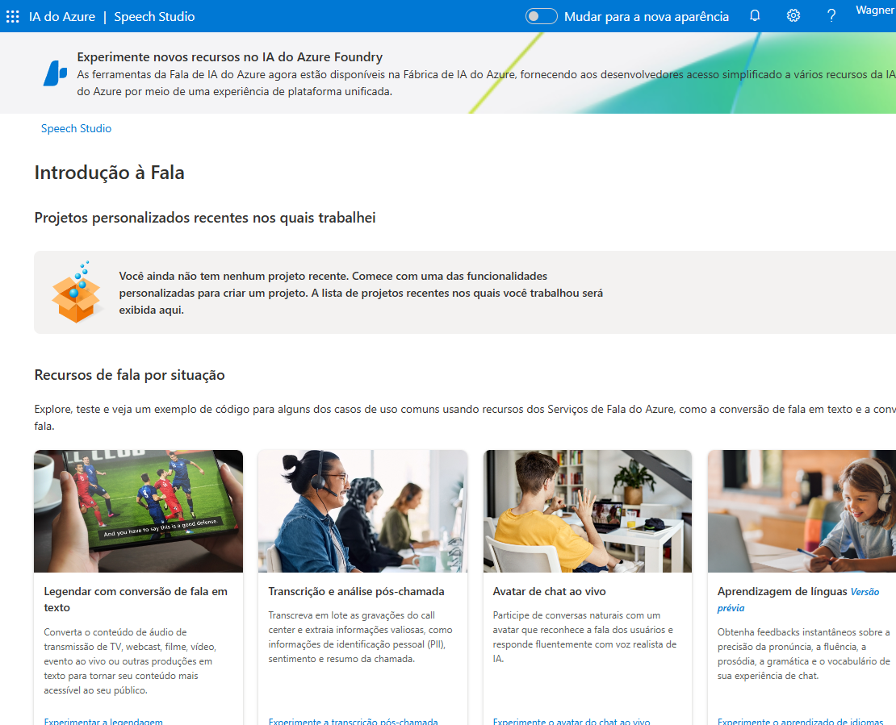
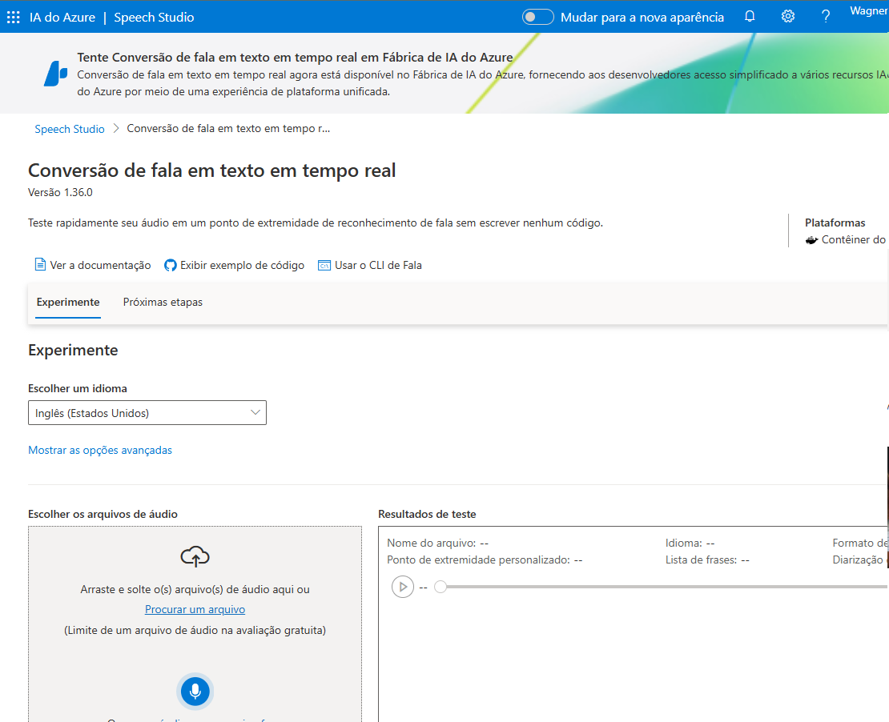
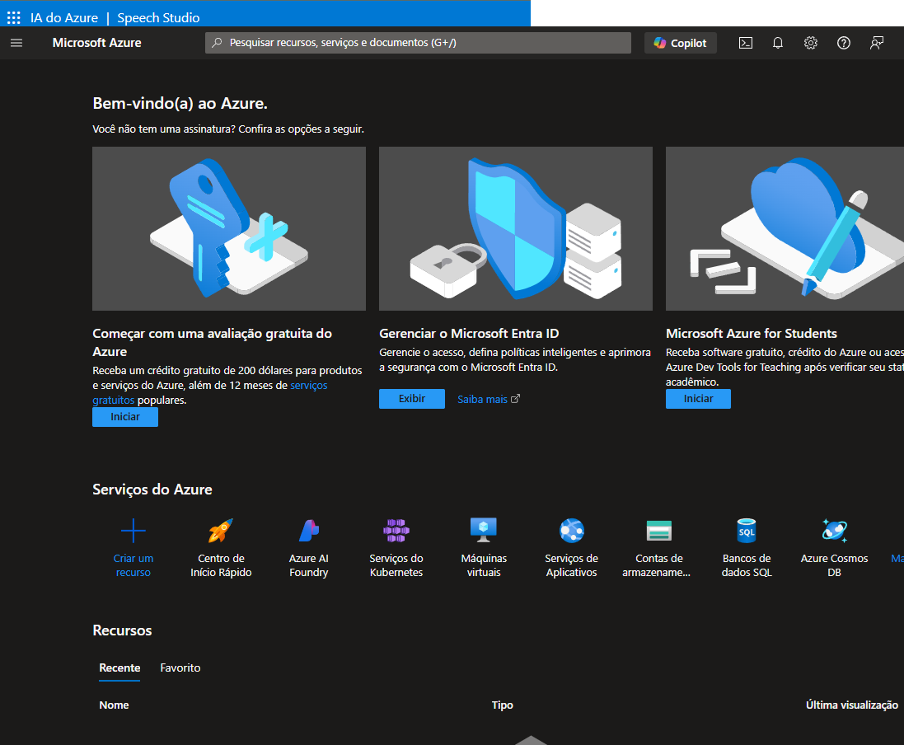

## 🌟 Desafio de Projeto: Análise de Fala e Linguagem Natural com Azure

### 📌 Introdução
Neste projeto vamos explorar o uso das ferramentas **Azure Speech Studio** e **Language Studio**. O objetivo é praticar a análise de fala e linguagem natural, aplicando os conceitos aprendidos nas aulas e documentando a experiência adquirida.

### 🎯 *Pré-requisitos*
- **Conta Microsoft**: Certifique-se de possuir uma conta ativa. Novos usuários podem aproveitar um período gratuito de 30 dias. 
Dica: Pode utilizar da <a href="https://escoladotrabalhador40.com.br">Escola do trabalhador 4.0</a>.

### 🚀 *Vamos Começar!*

#### Acesse IA do Azure | Speech Studio
- Navegue até o <a href="https://speech.microsoft.com/portal/">Speech Studio</a>.
- Faça login na sua conta Microsoft.

- Vá em **Configurações** 
  - **+ Criar novo recurso** *(caso ainda não tenha)*
  - Preencha as informações necessárias para concluir a criação
  - Selecione o recurso criado e clique em **Usar o recurso**, depois pode fechar para retornar a janela anterior
- Mova a rolagem para baixo e clique em **Conversão de fala em texto em tempo real**

- Selecione o idioma do arquivo de áudio que a ser importado 
- Clique em **Procurar um arquivo** e selecione o arquivo de sua preferência para que  *Automagicamente se inicie o processo da conversão*

Em **Próximas etapas** abaixo você pode observar as opções e casos de uso.

---

#### 🚀 *Conhecendo o Azure Language Studio!*

### 📊 Passos para Configurar Interpretação de Sentimentos no Azure Language Studio

#### 1. Acessar o Azure Language Studio
   - Entre na sua conta do Azure.
   - Navegue até o **Azure Language Studio**.

#### 2. Criar um Tópico
   - Clique em **"+ Criar um recurso"**.
   - Escolha categoria **IA + Machine Learning**
   - **Serviço de Linguagem**
   - Criar e continuar
   - Preencha as informações... Free F0
   - Marque 30 dias sem cobrança
   - Revisar e Criar

#### 3. Selecionar o ítem que irá utilizar
   - No [Serviço Cognitivo do Azure](https://language.cognitive.azure.com/home)
   - Preencha as informações
   - Classify text
   - Analyze sentiment and mine opinions
   - Insira o texto a ser analizado
   - Marque o checkbox e clique em Run

#### 💡 Dicas Adicionais
- **Teste com Diversos Exemplos**: Use diferentes tipos de textos para ver como a análise de sentimentos se comporta.
- **Considere o Contexto**: A interpretação de sentimentos pode variar dependendo do contexto; ajuste seu modelo conforme necessário.
- **Utilize Recursos Adicionais**: Consulte a documentação oficial do Azure para obter mais informações e exemplos.

---

### 🔗 Links Úteis
- [Portal do Speech Studio](https://speech.microsoft.com/portal)
- [Conversão de fala em texto](https://speech.microsoft.com/portal/speechtotexttool)
- [Portal Azure](https://portal.azure.com/#home)

### 🛠️ Recursos Úteis
- **Documentações Oficiais**:
  - [Explorar Speech Studio - Laboratório no Microsoft Learning](https://microsoftlearning.github.io/mslearn-ai-fundamentals/Instructions/Labs/09-speech.html)
  - [Analyze text with Language Studio - Laboratório no Microsoft Learning](https://microsoftlearning.github.io/mslearn-ai-fundamentals/Instructions/Labs/06-text-analysis.html)

---

*Este projeto foi uma excelente oportunidade para aplicar os conhecimentos adquiridos e documentar a jornada no uso de ferramentas de IA da Azure para análise de fala e linguagem. A experiência foi enriquecedora e servirá como base para futuros projetos!*

---
---

### 👨‍💻 Expert

    
&nbsp&nbsp&nbsp Wagner Andrade 
    &nbsp&nbsp&nbsp
    <a href="https://github.com/wsawebmaster">
    GitHub</a>&nbsp;|&nbsp;
    <a href="https://www.linkedin.com/in/
wsawebmaster">LinkedIn</a>
&nbsp;|&nbsp;
<a href="mailto:wsawebmaster@yahoo.com.br">
    Email</a>
  &nbsp;|&nbsp;

